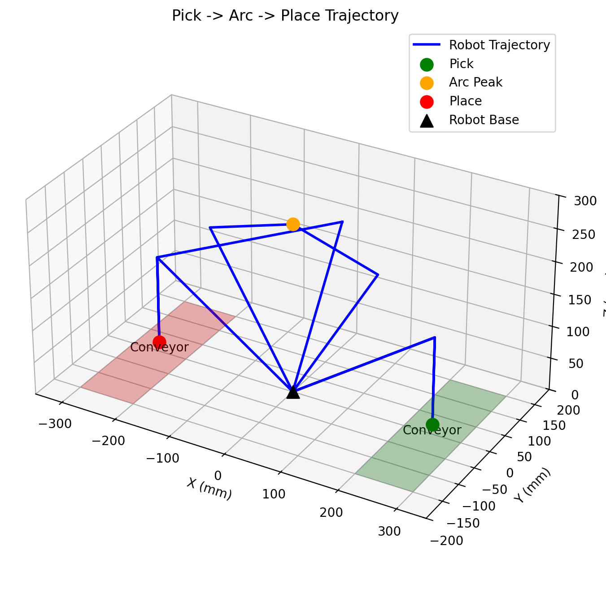
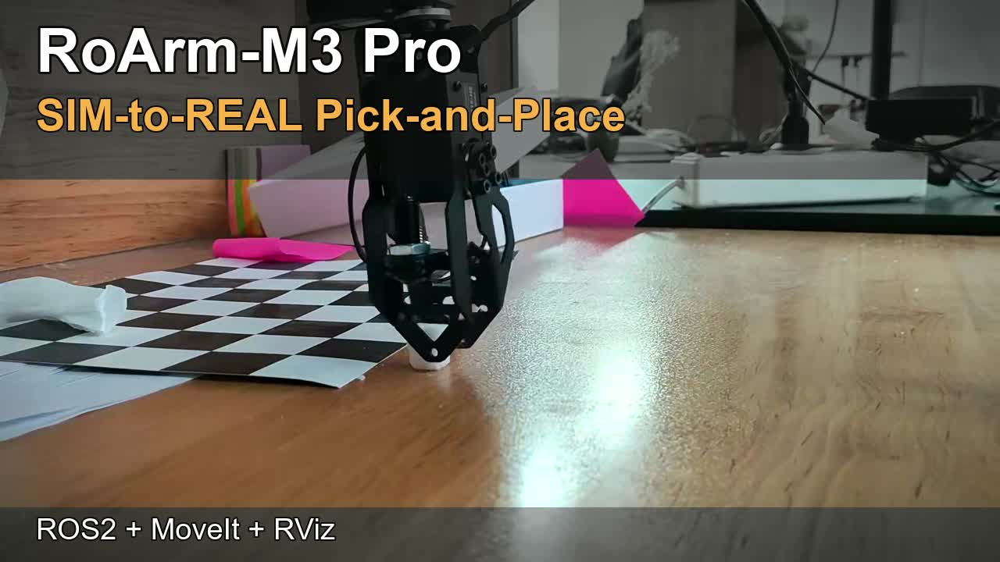

# RoArm-M3 Pro Sim-to-Real Pick-and-Place (ROS2 + MoveIt)

This repository contains the complete implementation of an Advanced Robotics project focused on:

- kinematic modeling of **RoArm-M3 Pro**
- simulation and motion planning in **ROS2 / MoveIt / RViz**
- custom ROS2 node for autonomous **pick-and-place**
- transfer from simulation to physical robot (**Sim-to-Real**)



## Project Video

[](https://youtu.be/zClMNYY4x1M)

Direct link: https://youtu.be/zClMNYY4x1M

## Repository Structure

```text
.
├── roarm_p/
│   ├── CMakeLists.txt
│   ├── package.xml
│   ├── src/
│   │   └── simple_pick_place.cpp
│   ├── launch/
│   │   └── auto_pick.launch.py
│   ├── config/
│   │   └── path_plan.json
│   ├── scripts/
│   │   └── visualize_path.py
│   └── notebooks/
│       └── workspace-simulation-monte-carlo.ipynb
└── assets/
    ├── trajectory_preview.png
    └── youtube_thumbnail.jpg
```

## Detailed Implementation Process

### 1) Hardware Characterization and Constraints

The project started from the physical and architectural limits of RoArm-M3 Pro:

- 5+1 DoF (base, shoulder, elbow, wrist pitch, wrist roll, gripper)
- low payload and educational-grade mechanics
- controller based on ESP32 with ROS2-compatible software stack

Working assumptions used throughout implementation:

- effective horizontal reach around 0.5 m (diameter around 1.12 m)
- vertical reach around 0.8 m
- constraints from lightweight structure and serial communication latency

### 2) Kinematic Modeling (DH, FK, IK, Jacobian)

Using report-derived geometry and measured CAD values, the manipulator was modeled with standard Denavit-Hartenberg parameters. Key dimensions used in calculations:

- base height `d1 = 179.52 mm`
- shoulder offset `d2 = 30 mm`
- upper arm length `a2 = 236.82 mm`
- forearm length `a3 = 316.15 mm`

The notebook (`roarm_p/notebooks/workspace-simulation-monte-carlo.ipynb`) was used to:

- compute forward kinematics (homogeneous transform chain)
- derive analytical IK relations for target pose solving
- analyze Jacobian behavior and singularity modes
- run Monte Carlo workspace simulation for feasibility checks

### 3) Simulator Selection: RoboDK to RViz Migration

Implementation first attempted RoboDK with STEP CAD import, but the report documents practical blockers:

- excessive part fragmentation after split operations
- non-standard origin/frame alignment between links
- unstable serial-chain definition for this educational robot geometry

As a result, the project moved to RViz/ROS2, which matched the existing RoArm ROS ecosystem and enabled faster integration with URDF, topics, and MoveIt.

### 4) ROS2 Package Build-Out

The package `roarm_p` was built as an `ament_cmake` package around a C++ control node and a Python launch pipeline.

Core files:

- `roarm_p/src/simple_pick_place.cpp`
- `roarm_p/launch/auto_pick.launch.py`
- `roarm_p/CMakeLists.txt`
- `roarm_p/package.xml`

The launch pipeline in `auto_pick.launch.py` performs:

- hardware mode detection via `/dev/ttyUSB0`
- dynamic configuration for real vs fake hardware
- loading robot description (`URDF/Xacro`, `SRDF`, kinematics yaml)
- delayed start of the custom node to allow MoveIt stack readiness

### 5) Motion Strategy and Pick-and-Place Algorithm

The implemented cycle is an autonomous repeating sequence:

1. move to home and open gripper
2. move to pick hover
3. descend to pick and close gripper
4. lift to safe hover
5. transfer through an elevated arch waypoint
6. move to place hover
7. descend to place and open gripper
8. retract and return through arch for next cycle

Two practical anti-singularity decisions from real experiments were encoded:

- slight place-side Y-offset to avoid 180-degree degeneracy around base alignment
- forced arch transfer on positive Y to keep return path stable and reduce cable/tangle and planner flips

### 6) Trajectory Representation and Visualization

A JSON waypoint plan (`roarm_p/config/path_plan.json`) is used for path inspection and communication clarity. The script `roarm_p/scripts/visualize_path.py` renders:

- pick/arc/place key points
- conveyor references
- full 3D path shape

This was used to validate geometric intent before on-robot execution.

### 7) Sim-to-Real Data Flow Design

The report-defined architecture follows ROS2 DDS pub/sub layers:

- robot-side driver publishes joint states
- `joint_state_publisher` and `robot_state_publisher` maintain kinematic state and TF
- RViz visualizes actual state in real time
- control commands are emitted as trajectory/joint messages and executed by robot-side control

Latency handling considered these stages:

- sensor/hardware transfer over UART
- ROS2 node processing period (`rclcpp::Rate` loop)
- DDS transport between processes
- TF/render refresh in RViz

### 8) Validation and Real-Robot Execution

After simulation convergence, the full cycle was executed on physical RoArm-M3 Pro:

- pick-and-place loop completed end-to-end
- motion sequence matched the simulation intent
- practical issues observed and managed: firmware mismatch, serial delay, initial calibration sensitivity

The final result was a stable demonstration of a low-cost educational arm running a reproducible Sim-to-Real pipeline.

## Requirements

- Ubuntu 22.04 (recommended)
- ROS2 Humble (or compatible)
- MoveIt2 and dependencies
- `roarm_moveit` and related RoArm packages from Waveshare setup
- Python 3 with `matplotlib`, `numpy`

## Build and Run

1. Put `roarm_p` inside your ROS2 workspace.

```bash
mkdir -p ~/roarm_ws/src/roarm_main
cp -r roarm_p ~/roarm_ws/src/roarm_main/
```

2. Build.

```bash
cd ~/roarm_ws
colcon build --packages-select roarm_p
source install/setup.bash
```

3. Launch.

```bash
ros2 launch roarm_p auto_pick.launch.py
```

## Authors

- Seyed Mahdi Sarfarazi
- Amin Parsafar
- Mohammad Hossein Ebrahimi

## References

- Waveshare RoArm-M3 Wiki: https://www.waveshare.com/wiki/RoArm-M3
- Waveshare setup tutorial: https://www.youtube.com/watch?v=aGMcTiRKnYQ
